## Лабораторная работа 1

Для выполнения заданий я использую виртуальную машину (VirtualBox) с Ubuntu server 24.04

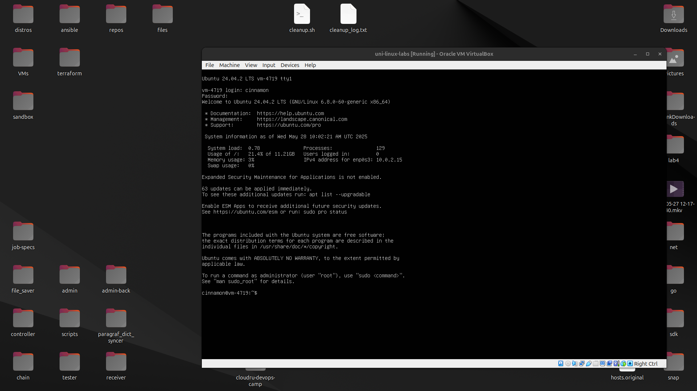

### Часть 1. 

С помощью ```useradd``` cоздаю 4 пользователей **test1**, **test2**, **test3**, **test4**.

Флаг ```-m``` создает домашнюю директорию для пользователя (```/home/<username>```).

Флаг ```-s``` позволяет указать путь к login shell для данного пользователя.

С помощью ```passwd``` задаю пользователям пароли.

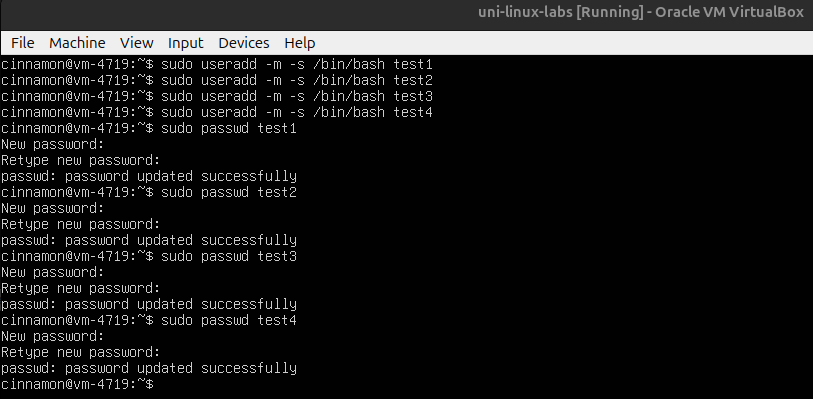

### Часть 2. 

Для пользователей **test1**, **test2* разрешаю получение полномочий root c помощью ```useradd```.

Флаги ```-aG``` позволяют "дописать" новую группу в список уже существующих.

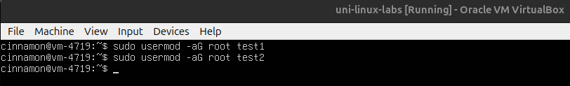

### Часть 3. 

С помощью ```su``` (substitute user) переключаюсь на **test3**.

С помощью ```cd ~``` перехожу в домашнюю директорию пользователя **test3** \
(```~``` и ```$HOME``` указывают на домашнюю директорию для текущего пользователя).

С помощью ```touch``` создаю файл **MyBeautifulFile.txt**, 

С помощью ```ls``` (list) проверяю наличие файла.

Повторяю действия для пользователя **test4**.

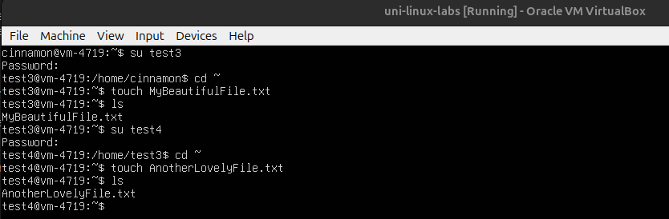

### Часть 4. 

С помощью ```groupadd``` создаю группу **pcap** (packet capture).

С помощью ```usermod -aG``` добавляю пользователя **test3** в эту группу.

С помощью ```chgrp``` задаю исполняемому файлу ```/bin/tcpdump``` группу-владельца **pcap**. 

С помощью ```chmod``` задаю исполняемому файлу права доступа **750** (**rwxr-x---**).

Таким образом владелец файла (**root**) получает полный контроль (**rwx**) над файлом; все участники группы **pcap** получают права на чтение и исполнение (**r-x**); все остальные пользователи не получают никаких прав на файл(**---**).


Проверяю, что **test3** может использовать ```tcpdump```, а другие пользователи (**test4**) - нет.

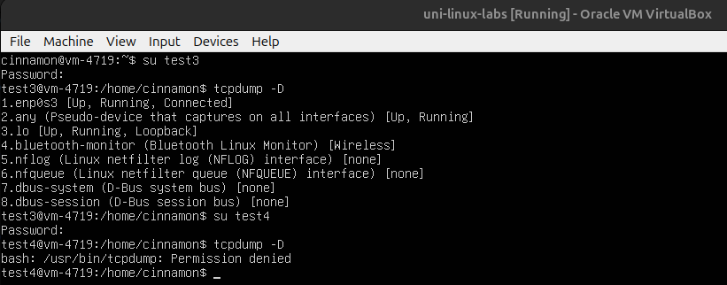

### Часть 5. 

С помощью ```groupadd``` создаю группы **group1** и **group2**.

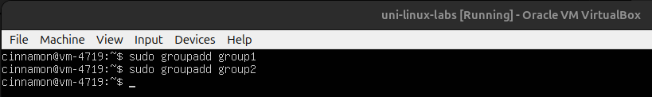

### Часть 6. 

С помощью ```usermod -g``` устанавливаю пользователям **test2**, **test3** основную группу **group1**, пользователям **test1**, **test4** основную группу **group2**.

Проверяю основные группы с помощью ```id -gn```

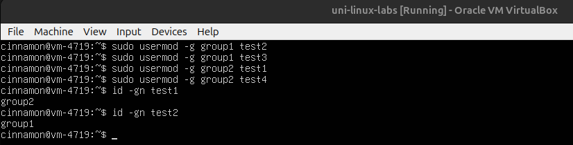

### Часть 7. 

С помощью команд ```echo``` и ```tee``` создаем и заполняем конфигурацией файл **group1** в ```/etc/sudoers.d/```.

Файлы в данной директории описывают пользователей с доступом к sudo и автоматически включаются в ```/etc/sudoers/```.

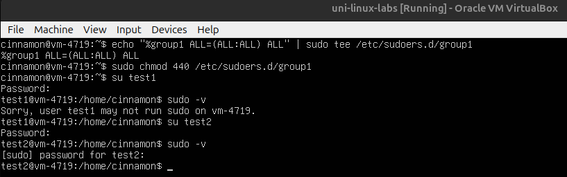

### Часть 8. 

Под пользователем test2 создаю файл. Настраиваю права доступа к файлу —
для группы group1 – разрешено чтение, для группы group2 — запрещаю чтение, запись и исполнение.

rw- r-- ---

С помощью ```su``` переключаюсь на пользователя **test2**. 

С помощью ```echo``` создаю файл и заполняю его текстом.
```cat``` 

С помощью ```chown``` указываю владельцем файла группу **group1** (так как данная группа основная для пользователя **test2**, созданные им файлы по умолчанию получают данную группу в качестве владельца. данный шаг иллюстративен.)  

С помощью ```chmod 640``` настраиваю доступ к файлу: владелец файла может читать и писать, участники группы могут читать, остальные не могут взаимодейстовать с файлом. (**rw-r-----**)

Проверяю наличие/отсутствие доступа у разных пользователей.

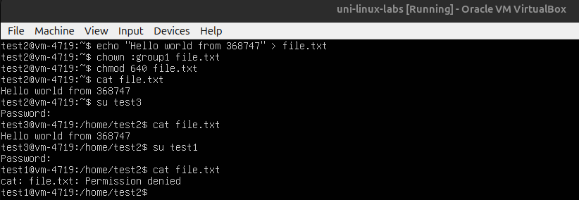

### Часть 9. 

С помощью ```usermod``` переименовываю пользователя **test2** в **test666**

Флаг ```-l``` также переименовывает домашнюю директорию пользователя. 

Убеждаемся в наличии изменений с помощью ```id``` и ```ls /home```

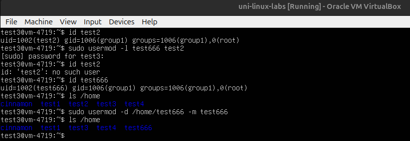

### Часть 10. 

С помощью ```userdel -r``` удаляю пользователей.

Флаг ```-r``` также удаляет домашнюю директорию пользователя в ```/home/```.

С помощью ```groupdel``` удаляю группы.

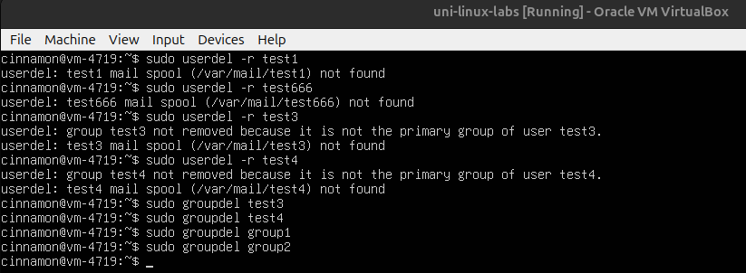