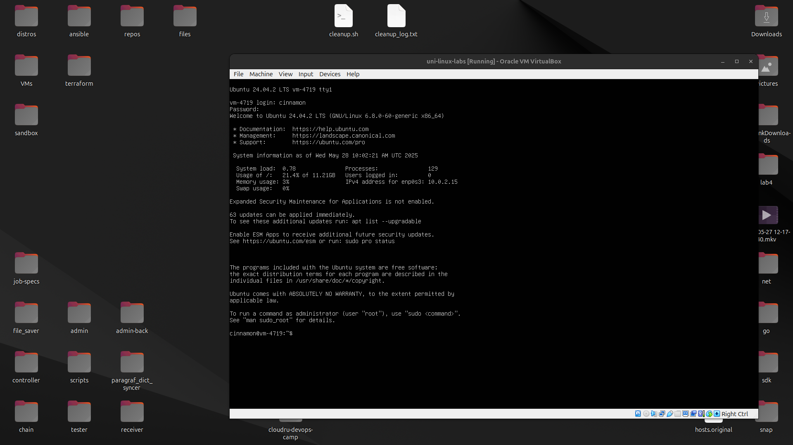
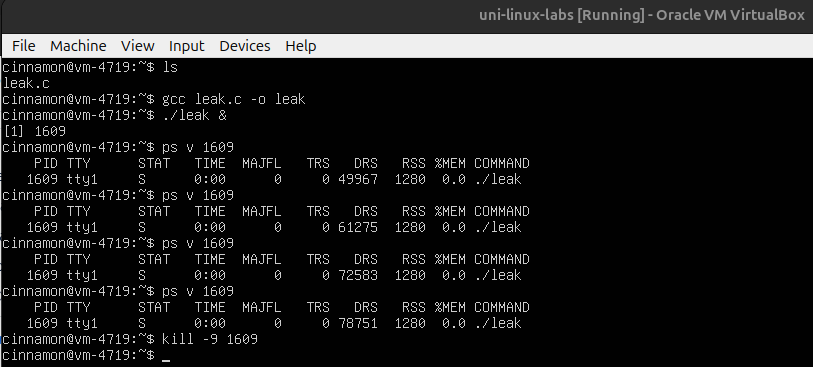
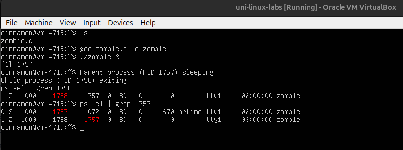
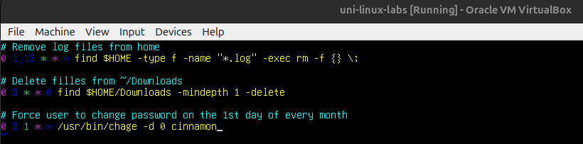

## Лабораторная работа 2

Для выполнения заданий я использую виртуальную машину (VirtualBox) с Ubuntu server 24.04



### Часть 1. Утечки памяти.

В данном репозитории находится файл ```leak.c```, содержащий утечку памяти. Каждые 0.1 секунду с помощью ```malloc``` он аллоцирует 1 мб памяти и (намеренно) не освобождает её. 



### Часть 2. Зомби процесс.

В данном репозитории находится файл ```zombie.c```, порождающий зомби-процесс.



### Часть 3. Cronjobs.



### Часть 4. Bash.
